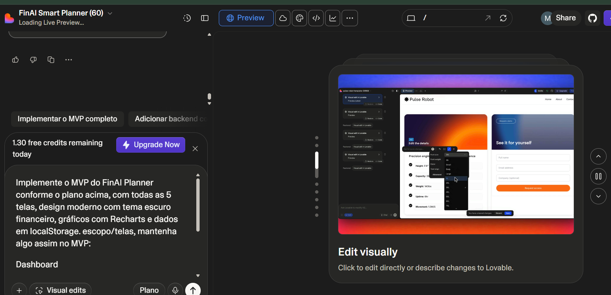
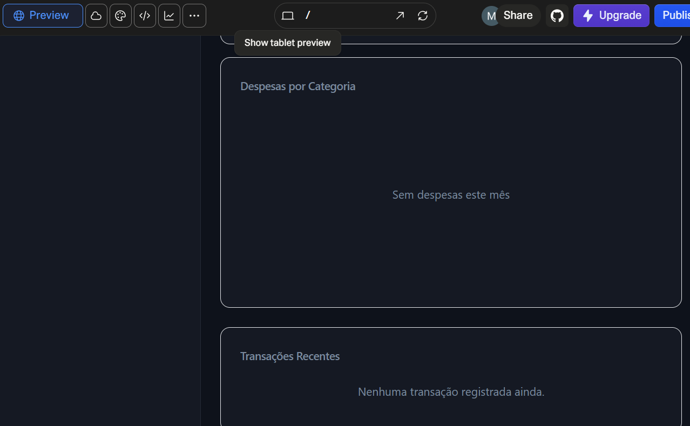
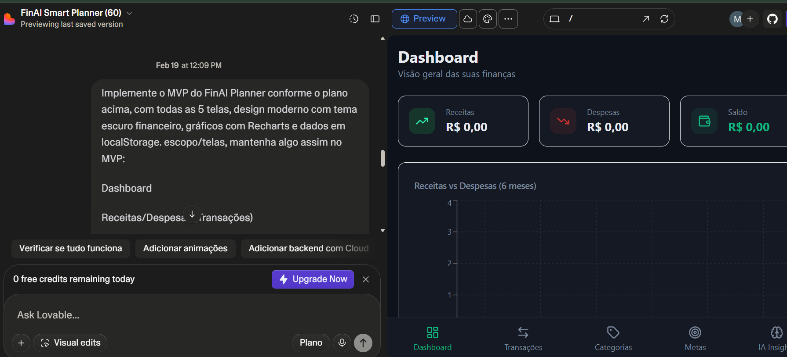
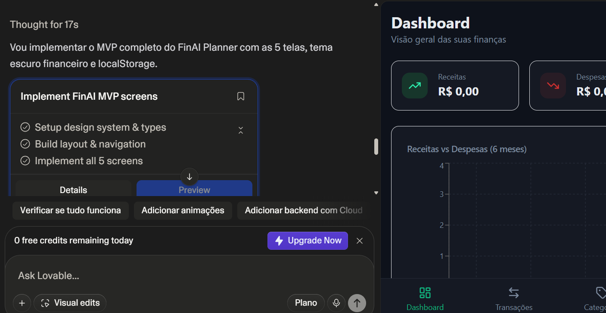

💰 FinAI Planner
📌 Sobre o Projeto

O FinAI Planner é um aplicativo de organização financeira pessoal com Inteligência Artificial, criado com o objetivo de ajudar usuários a entender seus padrões de gastos, identificar desperdícios e tomar decisões financeiras mais inteligentes.

O app utiliza IA para classificar despesas automaticamente, gerar insights personalizados e prever possíveis dificuldades financeiras com base no comportamento do usuário.

🎯 Funcionalidades

Cadastro de receitas e despesas

Classificação automática de gastos com IA

Dashboard com gráficos financeiros

Sistema de metas

Simulador de economia futura

Alertas inteligentes de gastos

Botão de análise financeira com IA

🧠 Prompt Final (PRD)

(cole aqui o PRD que te enviei acima)

💡 Conceito do App

O FinAI Planner foi desenvolvido com foco em auxiliar usuários comuns a organizarem sua vida financeira de forma simples, visual e inteligente.

A proposta é ir além do controle manual de despesas, utilizando IA para oferecer recomendações estratégicas personalizadas.

📚 Aprendizados

Neste projeto, aprendi:

Como estruturar um PRD claro para orientar ferramentas de IA

Como utilizar prompts detalhados para gerar aplicações completas

A importância de organização e documentação no GitHub

Como transformar uma ideia em um projeto estruturado

Evidências
1) Execução do Prompt e Início da Implementação

Nesta imagem é possível visualizar o momento em que o prompt estruturado foi enviado ao Lovable solicitando a implementação do MVP completo com as 5 telas (Dashboard, Transações, Categorias, Metas e IA Insights), incluindo tema escuro, gráficos com Recharts e uso de LocalStorage.

2) Confirmação da Implementação do MVP

Aqui é possível observar a resposta do Lovable confirmando a implementação das etapas do projeto:
- Setup do design system
- Construção do layout e navegação
- Implementação das 5 telas

3) Estrutura do Dashboard no Preview

Nesta imagem é exibido o preview do Dashboard do FinAI Planner, contendo:
- Cards de Receita, Despesa e Saldo
- Layout com tema escuro
- Estrutura organizada e responsiva

4) Gráficos e Visualização Financeira

Esta evidência apresenta a área de gráficos do Dashboard, incluindo o comparativo "Receitas vs Despesas (6 meses)".

5) Navegação entre Telas do MVP

A imagem mostra o menu lateral com as cinco seções principais:
- Dashboard
- Transações
- Categorias
- Metas
- IA Insights

