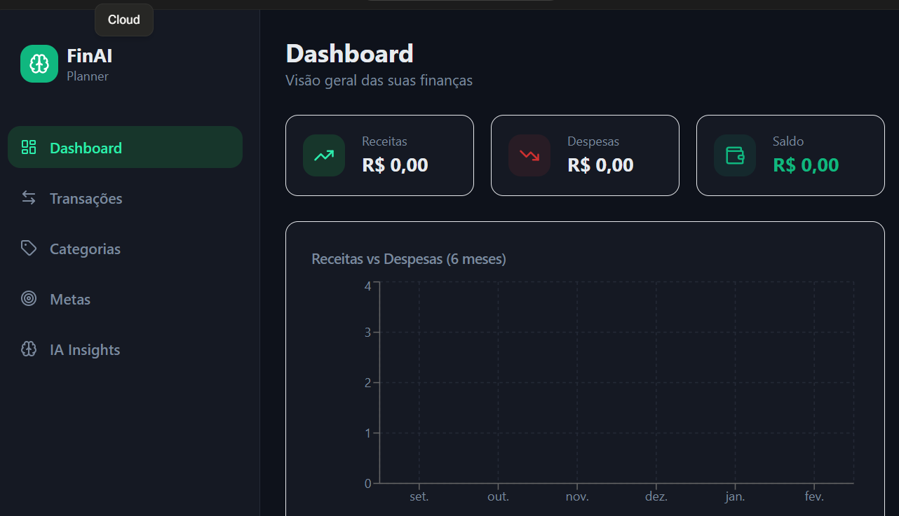

💰 FinAI Planner
📌 Sobre o Projeto

O FinAI Planner é um aplicativo de organização financeira pessoal com Inteligência Artificial, criado com o objetivo de ajudar usuários a entender seus padrões de gastos, identificar desperdícios e tomar decisões financeiras mais inteligentes.

O app utiliza IA para classificar despesas automaticamente, gerar insights personalizados e prever possíveis dificuldades financeiras com base no comportamento do usuário.

🎯 Funcionalidades

Cadastro de receitas e despesas

Classificação automática de gastos com IA

Dashboard com gráficos financeiros

Sistema de metas

Simulador de economia futura

Alertas inteligentes de gastos

Botão de análise financeira com IA

🧠 Prompt Final (PRD)

(cole aqui o PRD que te enviei acima)

💡 Conceito do App

O FinAI Planner foi desenvolvido com foco em auxiliar usuários comuns a organizarem sua vida financeira de forma simples, visual e inteligente.

A proposta é ir além do controle manual de despesas, utilizando IA para oferecer recomendações estratégicas personalizadas.

📚 Aprendizados

Neste projeto, aprendi:

Como estruturar um PRD claro para orientar ferramentas de IA

Como utilizar prompts detalhados para gerar aplicações completas

A importância de organização e documentação no GitHub

Como transformar uma ideia em um projeto estruturado

Evidências
Evidências do desenvolvimento com Lovable

Prompt utilizado no Lovable

Nesta imagem é possível visualizar o prompt estruturado (PRD) enviado ao Lovable solicitando a implementação do MVP completo com as 5 telas, tema escuro financeiro, gráficos e armazenamento local.

2) Resposta da IA confirmando implementação

Aqui observamos a confirmação da IA indicando:
- Setup do design system
- Construção do layout e navegação
- Implementação das 5 telas do MVP

3) Dashboard do FinAI Planner (Preview final)

Nesta imagem vemos o preview do Dashboard do aplicativo, contendo:
- Cards de Receita, Despesa e Saldo
- Gráfico de comparação (Receitas vs Despesas)
- Tema escuro moderno
- Menu lateral com navegação entre as telas

